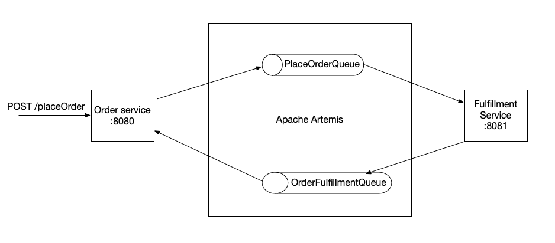

# Spring Boot JMS example with Apache Artemis

This repository contains an example of producing and consuming JMS messages with Spring Boot using Apache Artemis as the JMS broker.

- JMS messages are sent and received as json/text messages
- Domain objects are not shared between the two projects (allowing loose coupling)



## Setting up Apache Artemis

- Download latest version from [Artemis downloads page](https://activemq.apache.org/components/artemis/download/)
- Extract the zip file and create a broker instance (enter `username` and `password` as credentials when prompted)

  ```bash
  $ARTEMIS_HOME/bin/artemis create broker
  ```

- Update the broker configuration file (`broker/etc/broker.xml`) to add two new queues:

  ```xml
        <addresses>
          ...
         <address name="PlaceOrderQueue">
            <anycast>
               <queue name="PlaceOrderQueue" />
            </anycast>
         </address>
         <address name="OrderFulfillmentQueue">
            <anycast>
               <queue name="OrderFulfillmentQueue" />
            </anycast>
         </address>
          ...
        </addresses>
  ```

- Optional: the disk space is running low update the `max-disk-usage` setting to `100`

  ```xml
  <max-disk-usage>100</max-disk-usage>
  ```

- Finally, run the new broker instance

  ```bash
  broker/bin/artemis start
  ```

- Check the UI console (via <http://localhost:8161/console>) and verify that you can login using the credentials entered in the previous step

## Starting Spring Boot services

- Run `order-service`
- Run `fulfillment-service`

## Invoking the order-service `placeOrder` end-point

### Option 1: Use the Postman  collection

Use the Postman collection available in [docs/spring-boot-jms-example.postman_collection.json](docs)

### Option 2: Use the following `cURL` command

```bash
curl --location --request POST 'http://localhost:8080/placeOrder' \
--header 'Content-Type: application/json' \
--data-raw '{
    "orderId": 12343,
    "quantity": 1,
    "item": "iPhone 12 mini",
    "address": {
        "street": "10 Queens Court",
        "suburb": "Melbourne",
        "postcode": 3000
    }
}'
```
